<div align="center">

<a href="https://middlesugar7000.github.io/premium-saas-web-skill/"></a>

<br>

<a href="https://middlesugar7000.github.io/premium-saas-web-skill/"></a>
<a href="#install">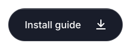</a>
<a href="https://vantle.studio/?utm_source=github&utm_medium=readme&utm_campaign=premium-saas-web#start"></a>

<br>

[](LICENSE)
[](skills/premium-saas-web/SKILL.md)
[](#benchmark-before-vs-after)
[](#install)

</div>

**premium-saas-web** is a free, open-source **Agent Skill** (`SKILL.md`) that teaches AI coding agents (**Claude Code, OpenAI Codex, Cursor and Google Antigravity**) to build **premium SaaS, AI-product, agency and portfolio websites**: landing pages that look like top-selling ThemeForest templates instead of generic AI output. It packs 4 complete design directions, 18 copy-ready CSS/HTML recipes (sculpted glows, animated gradient borders, tactile glass buttons, bento grids with mini product UIs, scroll-fill text) and a GSAP + Lenis motion system, all measured from real templates at the CSS level.

> Built and maintained by **[Vantle](https://vantle.studio/?utm_source=github&utm_medium=readme&utm_campaign=premium-saas-web)**, an independent design and development studio for brands, websites and software. If you'd rather have a studio ship it, [see how we work](#built-by-vantle).

## Contents

- [Benchmark: before vs after](#benchmark-before-vs-after)
- [Built by Vantle](#built-by-vantle)
- [What's inside](#whats-inside)
- [Install](#install) for [Claude Code](guides/claude-code.md) · [Codex](guides/codex.md) · [Cursor](guides/cursor.md) · [Antigravity](guides/antigravity.md)
- [Usage](#usage)
- [FAQ](#faq)

## Benchmark: before vs after

<a href="https://middlesugar7000.github.io/premium-saas-web-skill/"></a>

**Tested with Claude Opus 5.5.** Each prompt is the kind of one-liner a normal person types, with no style instructions. Every run used a fresh, empty folder through `claude -p`, with no memory and no conversation history. The only difference is whether the skill was loaded. The prompts were written in Hungarian, so the pages were generated in Hungarian; for this repo the page text was translated to English afterwards (text only, nothing re-generated, so the scores are unchanged). The brand and person names of two demos were anglicized for readability (Számlakör is shown as Billcircle, Bence Kovács as Ben Kovacs).

| Prompt | Without the skill | With `premium-saas-web` |
|---|---|---|
| *"Make a website for Flowpilot, software that automates teams' work in Slack, Notion and Gmail with AI agents."* | <a href="https://middlesugar7000.github.io/premium-saas-web-skill/demos/flowpilot-before/">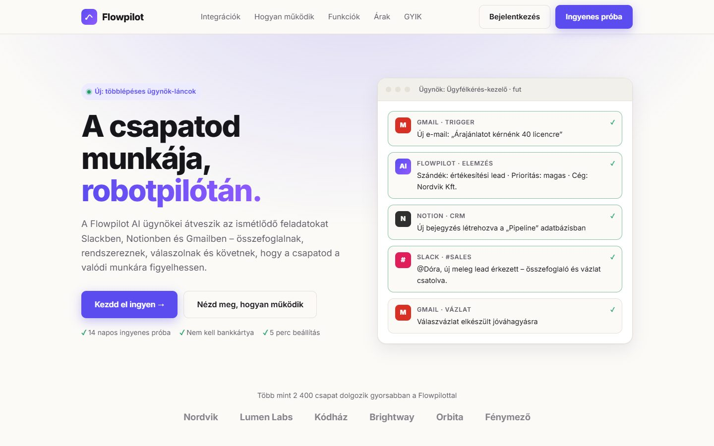</a> | <a href="https://middlesugar7000.github.io/premium-saas-web-skill/demos/flowpilot-after/">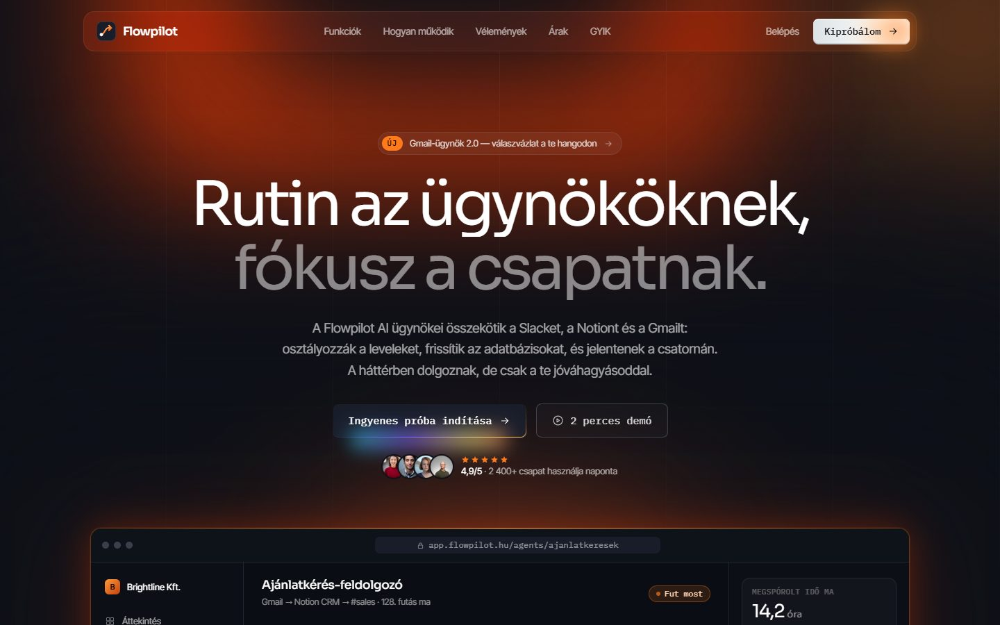</a> |
| *"Need a website for Northlane, a company doing AI consulting for businesses."* | <a href="https://middlesugar7000.github.io/premium-saas-web-skill/demos/northlane-before/">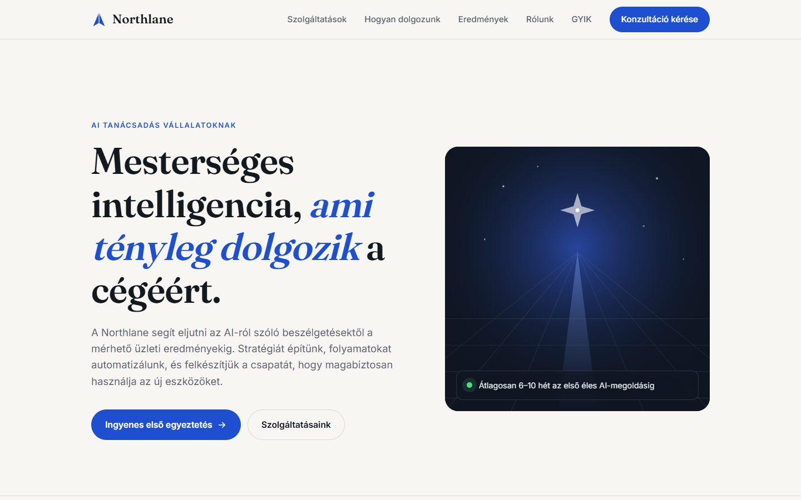</a> | <a href="https://middlesugar7000.github.io/premium-saas-web-skill/demos/northlane-after/">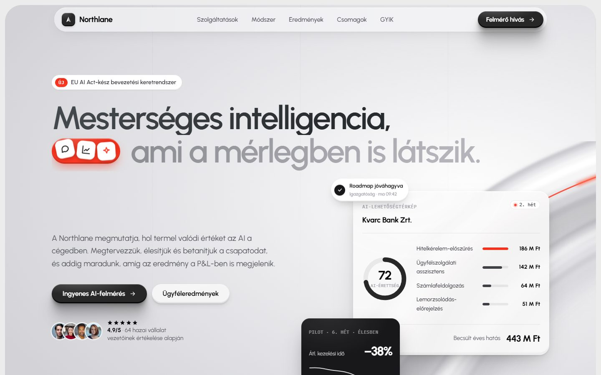</a> |
| *"Make me a portfolio site, I'm Ben Kovacs, a UX/UI designer."* | <a href="https://middlesugar7000.github.io/premium-saas-web-skill/demos/portfolio-before/">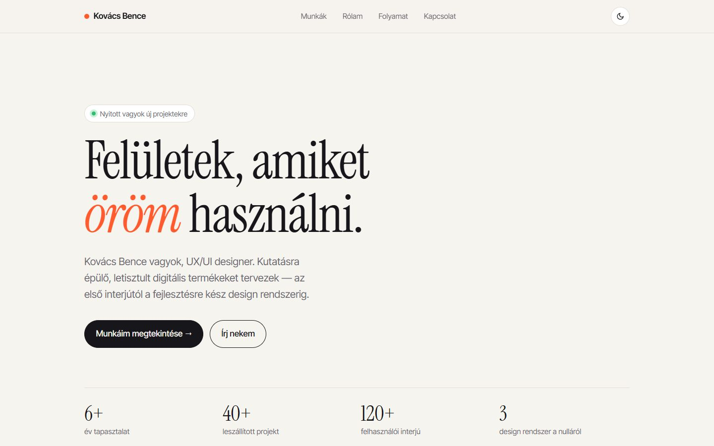</a> | <a href="https://middlesugar7000.github.io/premium-saas-web-skill/demos/portfolio-after/">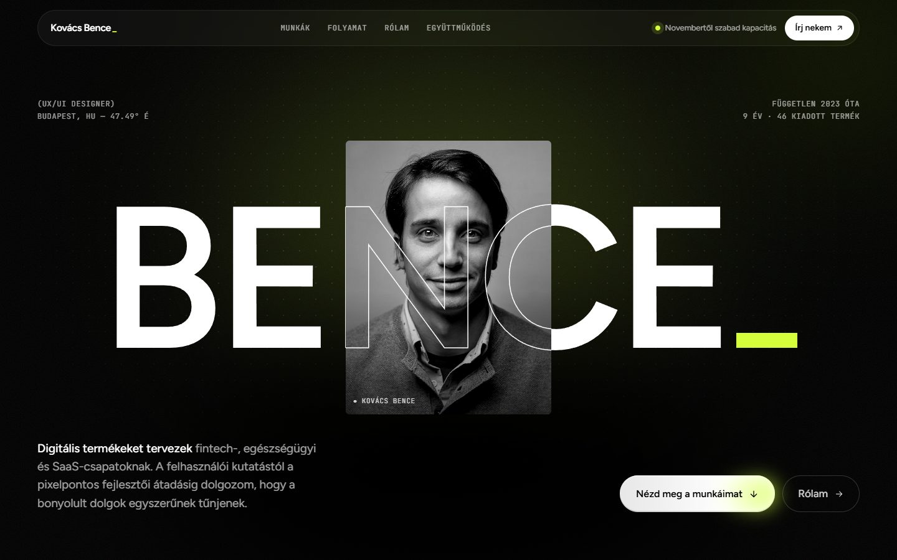</a> |
| *"Make a landing page for Billcircle, an online invoicing app for small businesses."* | <a href="https://middlesugar7000.github.io/premium-saas-web-skill/demos/invoicing-before/">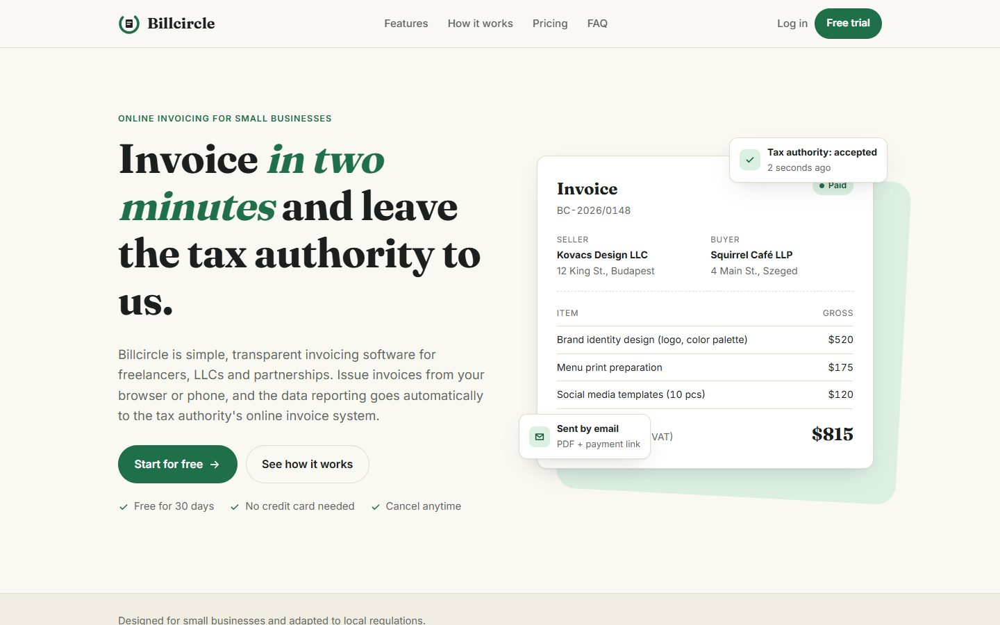</a> | <a href="https://middlesugar7000.github.io/premium-saas-web-skill/demos/invoicing-after/">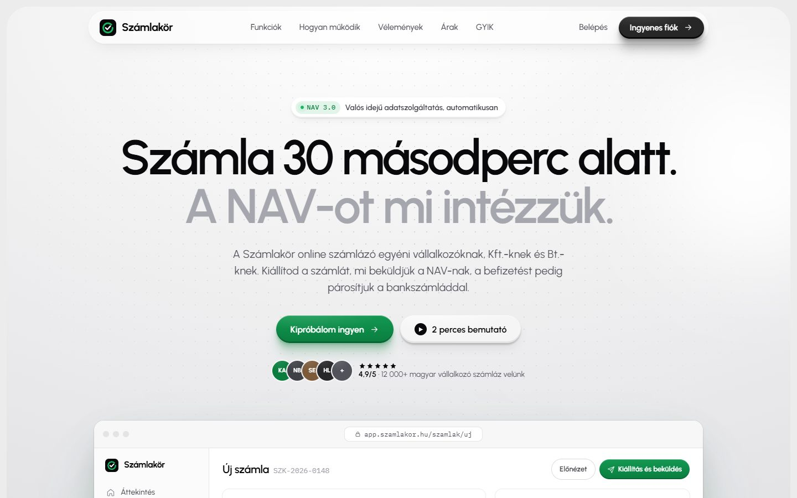</a> |

Click any screenshot to open the live page; the animations don't show in a still. The [interactive demo](https://middlesugar7000.github.io/premium-saas-web-skill/) has before/after sliders and full-page captures.

| Metric (mean of 4 runs) | With skill | Without skill |
|---|---|---|
| Automated quality checks passed | **98%** | 75% |
| Time per page | ~11 min | ~2.3 min |
| API cost per page | ~$2.70 | ~$0.70 |
| Opens its own page in a browser and fixes issues | yes | no |

The checks are mechanical, for example: design tokens on `:root`, tight display tracking, a real light source (large-blur glow), hairline borders, scroll-driven motion, `prefers-reduced-motion`, a marquee, responsive breakpoints, no lorem ipsum and no emoji icons. The scoring script and raw results are in [`benchmark/`](benchmark/). The motion and WebGL additions of v1.3.0 have their own small A/B check: [`benchmark/v1.3/`](benchmark/v1.3/README.md). The skill costs more time and tokens because it plans a direction, builds richer sections and reviews its own output.

## Built by Vantle

<a href="https://vantle.studio/?utm_source=github&utm_medium=readme&utm_campaign=premium-saas-web"></a>

<p align="center">
  <a href="https://vantle.studio/?utm_source=github&utm_medium=readme&utm_campaign=premium-saas-web#start"></a>&nbsp;
  <a href="https://vantle.studio/?utm_source=github&utm_medium=readme&utm_campaign=premium-saas-web#work"></a>&nbsp;
  <a href="mailto:hello@vantle.studio"></a>
</p>

This skill comes from **[Vantle](https://vantle.studio/?utm_source=github&utm_medium=readme&utm_campaign=premium-saas-web)**, an independent design and development studio. We turn what you're building into a brand people remember, a website they understand, and a product they can use.

- **Brand & identity:** positioning, logo systems, typography, colour and full design systems
- **Web design & 3D:** launch pages, Three.js and WebGL, GSAP motion, responsive builds
- **Full-stack product:** SaaS platforms, dashboards, APIs, auth, payments and AI features

A focused landing page usually takes 2 to 4 weeks; a complete SaaS build 6 to 12. Tell us what you're making at [hello@vantle.studio](mailto:hello@vantle.studio) or through the [project form](https://vantle.studio/?utm_source=github&utm_medium=readme&utm_campaign=premium-saas-web#start), and we'll reply within one business day.

<a href="https://vantle.studio/?utm_source=github&utm_medium=readme&utm_campaign=premium-saas-web#work"></a>

<a href="https://vantle.studio/?utm_source=github&utm_medium=readme&utm_campaign=premium-saas-web">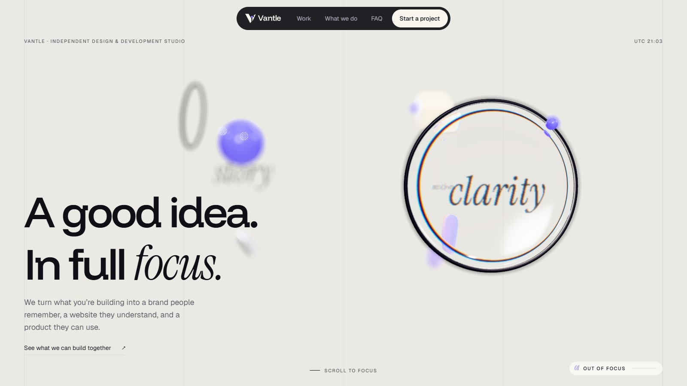</a>

## What's inside

```
skills/premium-saas-web/
├── SKILL.md                  # workflow, page rhythm, file map, self-review checklist, anti-patterns
├── directions/               # one folder per style: the agent reads only the one it picks
│   ├── README.md             # accent swapping + how to add a new direction
│   ├── ember-dark/style.md   # tokens, fonts, signature pieces + its own techniques
│   ├── tactile-light/style.md
│   ├── editorial-mono/style.md
│   └── noir-spotlight/style.md
└── shared/                   # techniques every direction uses, read per section
    ├── light.md              # sculpted glow, backgrounds, hairline grid
    ├── typography.md         # display type, scroll-fill text
    ├── product-proof.md      # browser mockup, bento mini-UIs
    ├── components.md         # glass nav, badges, marquees, pricing, footer
    ├── logos.md              # real brand logos, never letter placeholders
    └── motion.md             # GSAP + ScrollTrigger + SplitText + Lenis setup and gotchas
```

Adding a style is one new folder; see `directions/README.md`.

**4 design directions**, each measured from a real top-selling template:

| Direction | Feel | Best for |
|---|---|---|
| **Ember Dark** | Blue-black base, sculpted orange or blue glow, rainbow-border CTA, mono button labels | AI tools, dev tools, SaaS apps (default) |
| **Tactile Light** | Zinc surfaces, glossy press-able buttons, top-left sheen on cards, one hot accent | AI agencies, B2B SaaS, consultancies |
| **Editorial Mono** | #111 on #F0F0F0, 140px grotesk at −7% tracking, hairline grid, no shadows | Studios, premium services |
| **Noir Spotlight** | Pure black, one neon accent, giant name crossing a photo, stacking cards | Personal brands, portfolios |

**18 recipes**, including: sculpted glow (color blobs carved by background-colored "eraser" blobs), animated rainbow border with blurred under-glow, pill button with side glow, tactile glossy buttons (inset highlight + 5-step layered shadow), sheen cards, glass floating nav, hairline grid, display type with a dimmed half, scroll-fill text, browser-frame product mockup, bento grid with mini UIs and corner light leaks, avatar-stack eyebrow, masked marquees, dot/grid/noise backgrounds, outline-over-photo hero word, framed hero with a cut-in notch, featured pricing card and footer wordmark.

## Install

The skill is a single folder that follows the open [Agent Skills](https://agentskills.io) `SKILL.md` standard, so the same files work in every agent below.

**One command, any agent** ([skills CLI](https://github.com/vercel-labs/skills)):

```bash
npx skills add MiddleSugar7000/premium-saas-web-skill
```

Or copy the folder by hand:

| Agent | Global (all projects) | Per project | Full guide |
|---|---|---|---|
| **Claude Code** | `~/.claude/skills/premium-saas-web/` | `.claude/skills/premium-saas-web/` | [guides/claude-code.md](guides/claude-code.md) |
| **OpenAI Codex** | `~/.codex/skills/premium-saas-web/` | `.codex/skills/premium-saas-web/` | [guides/codex.md](guides/codex.md) |
| **Cursor** | `~/.cursor/skills/premium-saas-web/` | `.cursor/skills/premium-saas-web/` | [guides/cursor.md](guides/cursor.md) |
| **Google Antigravity** | `~/.gemini/antigravity/skills/premium-saas-web/` | `.agents/skills/premium-saas-web/` | [guides/antigravity.md](guides/antigravity.md) |

Claude Code can also install it as a plugin:

```
/plugin marketplace add MiddleSugar7000/premium-saas-web-skill
/plugin install premium-saas-web@middlesugar7000
```

## Usage

The skill loads automatically when you ask for a landing page, homepage, pricing page, waitlist or portfolio for a SaaS, AI, tech, agency or startup brand. Prompts as short as these work:

```text
Build a landing page for Flowpilot, an AI agent that automates Slack, Notion and Gmail work.
Make a portfolio site for me, I'm a UX/UI designer.
Redesign this pricing page so it looks premium.
```

To force it, name it: `/premium-saas-web build a waitlist page for ...` in Claude Code or Cursor, `$premium-saas-web ...` in Codex, or "use the premium-saas-web skill" in any agent. Ask for a direction if you have one in mind ("use Tactile Light with a blue accent").

## FAQ

**What is an Agent Skill?**
A folder with a `SKILL.md` file (YAML frontmatter plus Markdown instructions) and optional reference files. Agents read the short description all the time and load the full instructions only when a task matches, so a skill costs almost no context until it's needed.

**Which AI coding agents does premium-saas-web work with?**
Claude Code, OpenAI Codex CLI, Cursor and Google Antigravity are documented here. Any agent that supports the `SKILL.md` standard can use it, including those supported by `npx skills`.

**Does it need a specific framework?**
No. By default it writes a single HTML file with Tailwind via CDN, GSAP and Lenis. In an existing project it follows the project's stack (Next.js, React, Vue, Astro, plain CSS).

**Which model was it tested with?**
Claude Opus 5.5, in isolated `claude -p` runs: same prompt, same model, no memory, with and without the skill. See [Benchmark](#benchmark-before-vs-after).

**Is it free for commercial work?**
Yes. MIT license: use it for client projects, products and templates.

**Can I hire someone to build my site instead?**
Yes. [Vantle](https://vantle.studio/?utm_source=github&utm_medium=faq&utm_campaign=premium-saas-web#start), the studio behind this skill, designs and builds landing pages, SaaS products and AI features. Write to hello@vantle.studio; we reply within one business day.

## Credits and license

The design analysis studied publicly available demos of ThemeForest templates (OptimAI, Aigocy, Adon, Davies). This project is not affiliated with their authors and contains none of their code or assets. All techniques were re-implemented from measured CSS values.

[MIT](LICENSE) © 2026 MiddleSugar7000

<div align="center">
<br>
<a href="https://github.com/MiddleSugar7000/premium-saas-web-skill/stargazers"></a>
<a href="https://vantle.studio/?utm_source=github&utm_medium=readme&utm_campaign=premium-saas-web#start"></a>
</div>

<!-- update: v1 -->
<!-- update: v2 -->
<!-- sync: 2026-10-08-r1 -->
<!-- sync: 2026-10-08-r2 -->
<!-- sync: 2026-10-08-r3 -->
<!-- sync: 2026-10-09-1 -->
<!-- sync: 2026-10-09-2 -->
<!-- sync: 2026-10-09-3 -->
<!-- sync: 2026-10-09-4 -->
<!-- sync: 2026-10-10-1 -->
<!-- sync: 2026-10-10-2 -->
<!-- sync: 2026-10-10-3 -->
<!-- sync: 2026-10-10-4 -->
